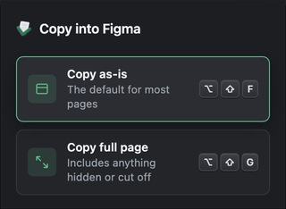

# FrameDrop


Copy the current web page into Figma as editable layers.

[Install FrameDrop from the Chrome Web Store](https://chromewebstore.google.com/detail/framedrop/dkdlfcbganhmbjbndnnknfiadfoinepb?utm_source=github)

FrameDrop works on the page you have open — no account, settings, or background monitoring. It supports normal `http://` and `https://` pages.

## Capture a page

1. Open the page and reach the exact UI state you want to bring into Figma.
2. Click the FrameDrop extension icon and choose a capture mode:
   - **Copy as-is** keeps the page arranged exactly as it is now.
   - **Copy full page** temporarily opens clipped or scrollable sections, captures them, then restores the page.
3. Wait for the green check, then paste into Figma with **Cmd+V**.

For open menus and popovers, use the shortcuts instead: **Option+Shift+F** for Copy as-is and **Option+Shift+G** for Copy full page. If a shortcut is already assigned, change it at `chrome://extensions/shortcuts`.



## Privacy and security

- FrameDrop requests `activeTab`, rather than permanent access to every website.
- It runs only after you click the icon or use a configured shortcut.
- Capture stays on your device and uses Figma's clipboard capture path; there is no account, analytics, cloud sync, or background monitoring.
- The bundled capture runtime does not download or execute newer remote code while you capture a page.
- Capture only content you are allowed to copy. Check for customer data, credentials, tokens, private messages, and other sensitive information first.

Read the full [privacy policy](PRIVACY.md).

## What to expect

FrameDrop creates a design reconstruction, not a pixel-perfect screenshot. Chrome blocks extensions on browser-owned pages such as `chrome://` and the Chrome Web Store. Cross-origin iframes, canvas/WebGL, video, browser PDF viewers, closed shadow roots, and protected assets may not convert faithfully.

## Develop locally

For development or contributing, you can load the checkout directly:

1. Open `chrome://extensions`.
2. Turn on **Developer mode**.
3. Click **Load unpacked** and select this FrameDrop folder.

Build the Chrome Web Store package with:

```sh
bash scripts/package-extension.sh
```

The package contains only the manifest, background script, capture entry point, vendored runtime, and icons. See [RUNTIME_SOURCE.md](RUNTIME_SOURCE.md) for the pinned capture-runtime source.

## Uninstall

Remove **FrameDrop** from `chrome://extensions`.
